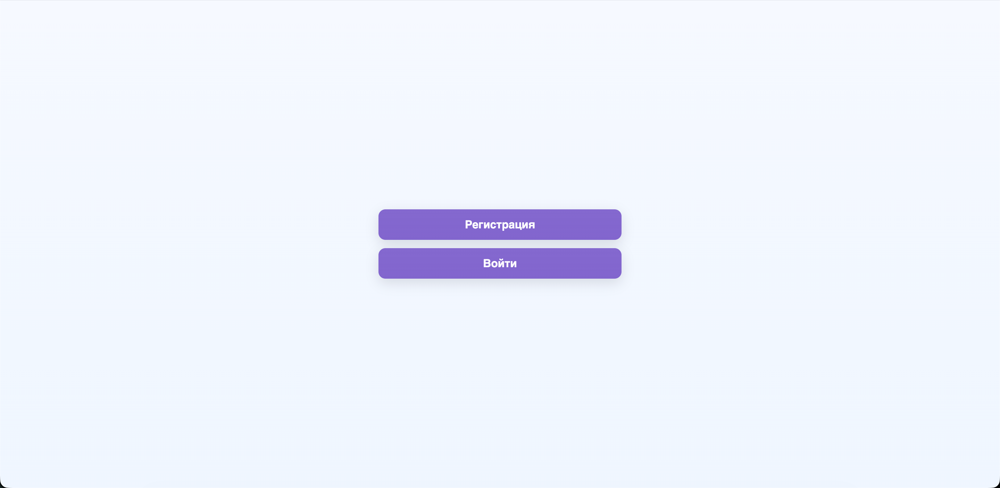
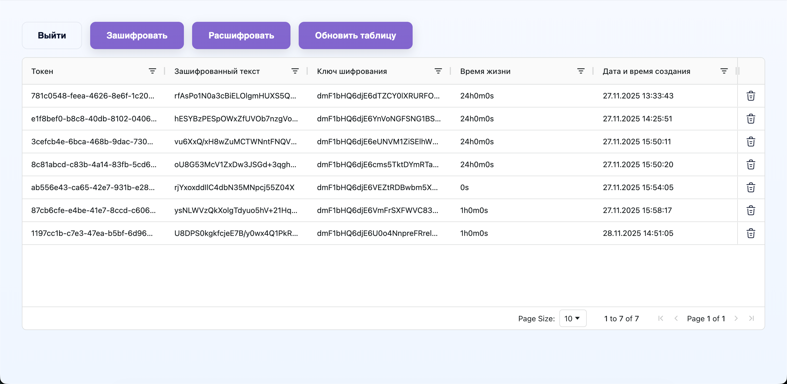

# Anonix

---
Сервис анонимизации данных с публичным REST API и набором микросервисов на Go. Разработан с учетом требований Федерального закона от 27.07.2006 №152-ФЗ «О персональных данных».

## Описание

---
Этот проект инкапсулирует логику шифрования текстовых данных. Сервисе поддерживает:
- Регистрацию и аутентификацию пользователей с использованием JWT-токенов.
- Шифрование и дешифрование текста с использованием KEK и DEK.
- Обработку ошибок, если данные некорректны или произошла внутренняя ошибка сервиса.

## Примеры и эндпоинты

---
Запустите проект и перейдите на [localhost:8080/swagger/index.html](http://localhost:8080/swagger/index.html)

## Веб-интерфейс панели администратора

---
Доступ к панели имеют только пользователи с ролью администратора в системе. Запустите проект и перейдите на [localhost:8080/admin/](http://localhost:8080/admin/)
<details>
    <summary>Нажми, чтобы увидеть интерфейс</summary>



</details>

## Требования к окружению

---
- [Golang 1.22+](https://go.dev/)
- ОС **Linux**, **macOS** или [WSL2](https://learn.microsoft.com/ru-ru/windows/wsl/install) на Windows
- Терминал с поддержкой `bash`

## Установка и запуск

---
### 1. Склонируйте репозиторий:
```bash
git clone https://github.com/NeF2le/anonix.git
cd anonix
```

### 2. Cкопируйте и по желанию измените файл `.env`:
**В `.env.example` уже указаны значения по умолчанию**
```bash
cp .env.example .env
```

### 3. Создайте пустую папку certs в корне проекта
```bash
mkdir certs
```

### 4. Запуск проекта:
Запуск с помощью `docker-compose`:
```bash
docker-compose up -d
```

## Поддержка TLS и mTLS

---
Публичный API сервиса поддерживает TLS, а микросервисы — mTLS. В папку `certs` добавьте свои сертификаты и измените конфиг:
```text
# ========== TLS ==========
TLS_ENABLED=true
TLS_ALLOW_AUTO_GENERATE=true
TLS_ROOT_PUBLIC_KEY=../certs/ca.pem
TLS_ROOT_PRIVATE_KEY=../certs/ca.key
TLS_SERVER_PUBLIC_KEY=../certs/server.pem
TLS_SERVER_PRIVATE_KEY=../certs/server.key
TLS_CLIENT_PUBLIC_KEY=../certs/client.pem
TLS_CLIENT_PRIVATE_KEY=../certs/client.key
TLS_DNS_NAMES=localhost,tokenizer,auth,mapping,vault
```
Либо используйте самоподписные сертификаты:
```bash
make generate_certs # сгенерирует root сертификаты 
```
Сертификаты для сервера и клиента создаются сами при настройке `TLS_ALLOW_AUTO_GENERATE=true`.

